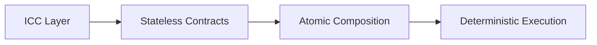
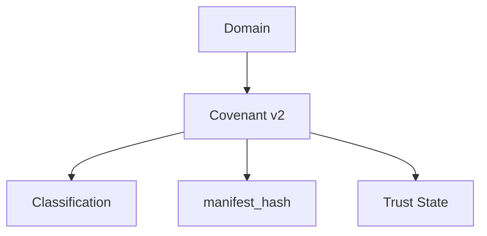
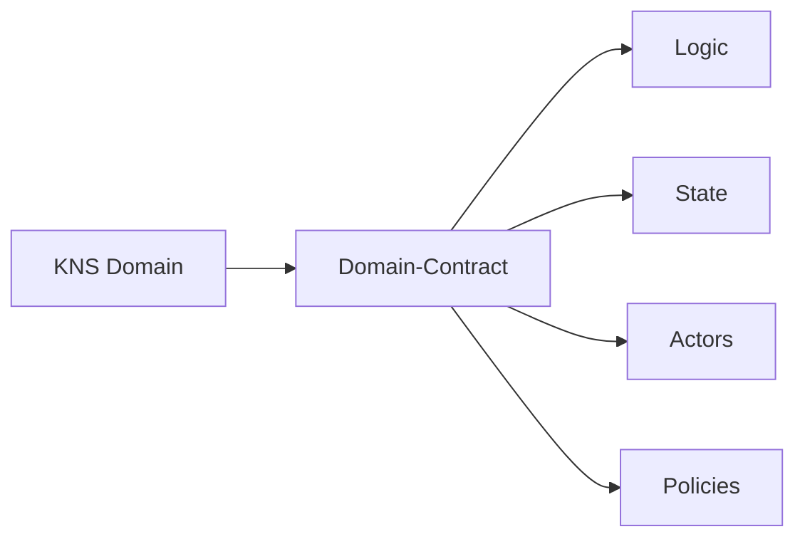
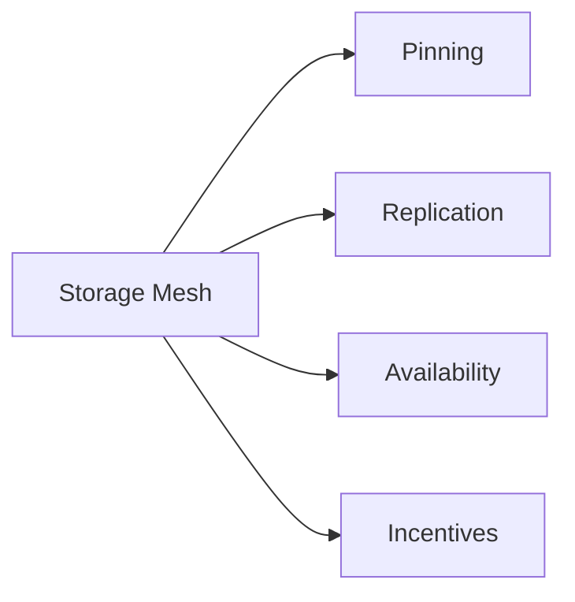
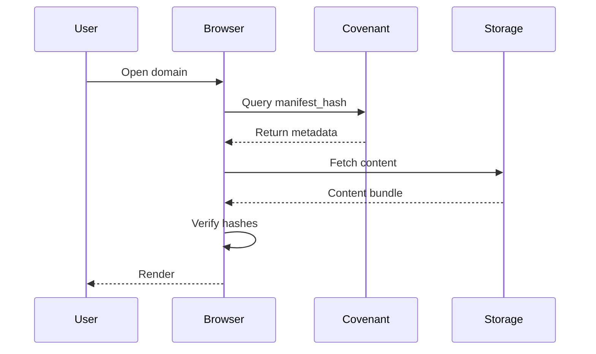
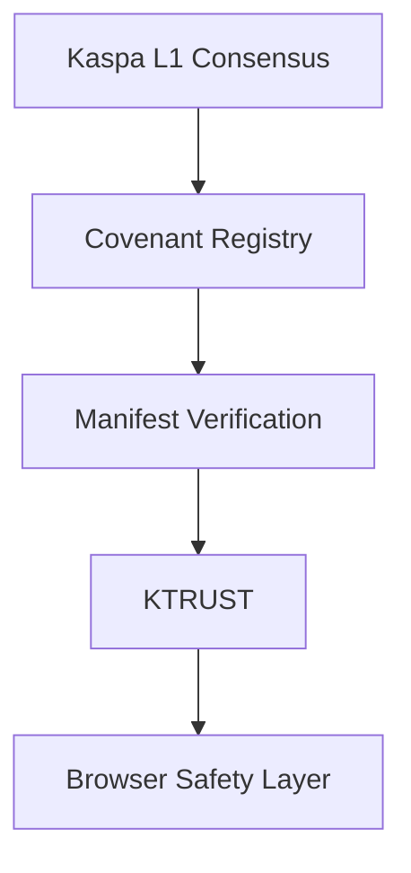
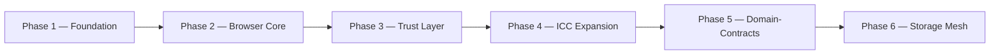

# 🟢⚫ KASPA WEB  
### Decentralized Internet Protocol  
**Whitepaper v2.0 — Protocol Architecture & Future Upgrade Path**

---

## Table of Contents

1. Title Page
2. Executive Summary
3. Vision & Problem Statement
4. Technical Architecture v2.0
5. Protocol Upgrade Notice — RFC + ICC Required
6. Storage Layer Architecture v1.1
7. Security & Integrity Model v2.0
8. Identity & Ownership v2.0
9. Governance & Evolution v2.0
10. Roadmap v2.0
11. Future Outlook

---

## 2. Executive Summary

Kaspa Web is a decentralized internet protocol built on top of the Kaspa BlockDAG. It defines an architecture in which domain ownership, content integrity, and trust are established through deterministic on-chain logic rather than through registrars, private indexers, or centralized certificate systems.

The protocol is composed of the following primary elements:

- Permanent on-chain identities, referred to as KNS domains
- Deterministic logic execution via ICC (Inter-Contract Communication)
- Covenant-based domain classification
- Manifest-verified content integrity
- An optional decentralized trust layer (KTRUST)
- A defined upgrade path toward full Domain-Contracts at Layer 1

Kaspa Web is fully functional today in its stateless ICC form. Domain registration, classification, content binding, and content verification operate under the current protocol without modification to Kaspa's consensus rules. A subset of advanced capabilities — including autonomous domain contracts, multi-actor logic, and protocol-native storage — depends on a future RFC and ICC upgrade, and is not yet available on Kaspa L1. This distinction between currently available functionality and future functionality is maintained explicitly throughout this document.

---

## 3. Vision & Problem Statement

### 3.1 Vision

Kaspa Web is designed to build an internet in which identity, access, and trust belong to users rather than to corporations, registrars, or centralized authorities.

### 3.2 The Problem

The traditional web architecture relies on a set of centralized dependencies:

| Dependency | Effect |
|---|---|
| Registrars controlling domain ownership | Domains are rented, not owned, and can be reassigned or revoked |
| Centralized indexers determining visibility | Discovery is mediated by private, opaque ranking systems |
| Mutable server-hosted content | Published content can be altered without user knowledge |
| Opaque trust systems | Trust signals are issued and revoked by single entities without transparency |

Kaspa Web is designed to remove these dependencies through cryptographic verification and decentralized logic execution.

### 3.3 KNS Domains

KNS domains are permanent, immutable identifiers stored on the Kaspa BlockDAG. On their own, a KNS domain is simply an identifier; it gains functional meaning through the **Covenant**, an ICC-powered logic layer described in Section 4.2.

---

## 4. Technical Architecture v2.0

### 4.1 ICC — Inter-Contract Communication

ICC (Inter-Contract Communication) is Kaspa's deterministic execution model. It provides:

- Stateless contracts
- Atomic composition
- Contract-to-contract messaging
- Deterministic logic
- Zero-server applications



**Justification:** ICC ensures that domain logic, trust logic, and classification logic behave identically across all nodes, without reliance on centralized servers. Because execution is deterministic and stateless at this stage, every node independently arrives at the same result when evaluating a domain's status, which removes the need for a trusted intermediary.

### 4.2 Covenant v2 — ICC-Powered Domain Logic

The Covenant is an ICC contract that transforms a domain into a meaningful object. It determines the domain's classification:

- Name
- Website
- Verified
- Reported
- Historical

The Covenant stores:

- Owner
- `manifest_hash`
- Classification
- Trust state
- Reports
- History



**Justification:** By placing domain logic inside ICC, Kaspa Web guarantees deterministic classification and content binding without relying on external infrastructure. Any node evaluating a domain's Covenant record reaches the same classification and content binding, independent of who operates that node.

### 4.3 Domain-Contracts (Future L1 Upgrade)

In future RFCs and hard-forks, KNS domains are intended to evolve into full smart contracts, capable of holding:

- Logic
- State
- Actors
- Policies
- Virtual state
- Storage rules



**Justification:** Turning domains into contracts allows them to become autonomous agents capable of enforcing rules, managing trust, and interacting with other contracts. This is a planned architectural extension and depends on the ICC and consensus upgrades described in Section 5; it is not part of the protocol's current, stateless implementation.

### 4.4 RFC — Protocol Evolution Mechanism

RFCs (Requests for Comment) define the formal specification process through which the protocol evolves. RFCs are expected to define:

- Domain-Contract specification
- ICC expansion rules
- Storage Mesh protocol
- Trust governance primitives
- Contract-level state models
- Multi-actor execution semantics

**Justification:** RFCs ensure that protocol changes are transparent, community-reviewed, and standardized prior to any hard-fork, so that extensions to consensus rules — such as those required for Domain-Contracts — are introduced through a documented and auditable process rather than unilaterally.

---

## 5. Protocol Upgrade Notice — RFC + ICC Required

Kaspa Web's full capability set depends on future protocol extensions that are not yet available on Kaspa L1. These extensions require the following, in sequence:

1. **RFC Approval** — Formal specification of Domain-Contracts, ICC expansion, Storage Mesh, and governance primitives.
2. **ICC Upgrade** — Support for contract-level state, actors, and multi-contract workflows.
3. **Hard Fork Activation** — Introduction of new consensus rules enabling Domain-Contracts and advanced ICC logic.

**Current Status:** Kaspa Web is fully functional today using stateless ICC contracts, Covenant v2 logic, manifest binding, and off-chain storage verification, as described in Sections 4 and 6.

**Summary Statement:** Full Domain-Contract functionality will only be enabled after the RFC and ICC upgrade described above is finalized and activated. No timeline is implied by this statement beyond the sequential dependency described.

---

## 6. Storage Layer Architecture v1.1

### 6.1 On-Chain Binding

Kaspa L1 stores only the minimal data required to establish ownership and content binding:

- Domain ownership
- `manifest_hash`
- Storage policy pointers

**Justification:** Storing only hashes and pointers, rather than content itself, keeps the L1 lightweight and scalable while still providing a cryptographic anchor for content verification.

### 6.2 Off-Chain Storage Sources

Kaspa Web retrieves content from the following sources:

| Source | Role |
|---|---|
| IPFS | Primary content retrieval |
| Kaspa Storage Mesh | Future decentralized storage layer |
| Signed Bundles | Offline / fallback distribution |
| HTTP fallback | Non-trusted fallback |

**Justification:** Decentralized, multi-source storage ensures content availability without requiring the blockchain itself to store file contents.

### 6.3 Kaspa Storage Mesh (Future RFC)

The Kaspa Storage Mesh is a planned decentralized storage network intended to provide:

- Pinning
- Replication
- Availability guarantees
- Anti-DoS protection
- Incentivized storage



**Justification:** IPFS alone does not guarantee long-term availability of content, since retrieval depends on peers choosing to host and serve a given file. The Storage Mesh is designed to add reliability and economic incentives for maintaining availability, and is defined as a future RFC rather than a currently active component.

### 6.4 Verification Pipeline

Every file retrieved through the storage layer is checked against the manifest hash recorded on-chain:

```
Domain → Covenant → manifest_hash → Storage Source → Content → Hash Verification → Rendering
```



**Justification:** Every file must match the manifest hash recorded on-chain, ensuring immutability and authenticity regardless of which off-chain source ultimately served the content.

---

## 7. Security & Integrity Model v2.0

Kaspa Web's security model is layered, so that the failure or compromise of a single layer does not compromise the integrity of the system as a whole:

- Kaspa L1 Consensus
- Covenant Registry (ICC)
- Manifest Integrity
- KTRUST (optional)
- Browser Safety Layer



**Justification:** Layered security ensures that even if one layer is degraded or unavailable, the remaining layers continue to maintain the integrity guarantees of the system. Consensus anchors ownership, the Covenant Registry anchors classification, manifest verification anchors content authenticity, KTRUST provides an optional economic trust signal, and the browser safety layer surfaces this information to the user.

### 7.1 KTRUST v2 — Decentralized Trust

KTRUST is an optional trust layer, not a requirement for domain resolution. It includes:

- Bond
- Escrow
- Cooling period
- Voting
- Slashing
- Restoration

**Justification:** This structure makes trust optional, decentralized, and economically aligned: participants who opt into KTRUST stake a bond that can be slashed or restored according to community-validated outcomes, without affecting the base-layer resolution of domains that do not participate in KTRUST.

---

## 8. Identity & Ownership v2.0

### 8.1 Permanent Identity

Domains registered under Kaspa Web are permanent, immutable, and censorship-resistant. Ownership is recorded on-chain and is not subject to renewal, expiration, or unilateral revocation by a third party.

### 8.2 Domain Lifecycle

**Creator:**
1. Build content
2. Upload
3. Generate manifest
4. Bind domain
5. Domain becomes website

**User:**
1. Enter domain
2. Browser queries Covenant
3. Retrieve content
4. Verify
5. Render

---

## 9. Governance & Evolution v2.0

Kaspa Web distinguishes between two levels of governance:

### 9.1 Protocol Governance

- RFC proposals
- Community review
- Hard-fork approval
- ICC extension

### 9.2 Application Governance

- KTRUST voting
- Domain-Contract policies
- Storage Mesh rules

**Justification:** Separating protocol-level governance (which changes Kaspa's consensus rules) from application-level governance (which changes how Kaspa Web's optional trust and storage components behave) ensures that experimentation at the application layer does not require a hard-fork, while changes to consensus remain subject to the more rigorous RFC and hard-fork process.

---

## 10. Roadmap v2.0



| Phase | Focus | Key Components |
|---|---|---|
| Phase 1 — Foundation | Core protocol primitives | KNS, Covenant v1, manifest architecture |
| Phase 2 — Browser Core | Resolution & rendering | Resolution, verification, safety layer |
| Phase 3 — Trust Layer | Optional decentralized trust | KTRUST v2, fraud-proof logic |
| Phase 4 — ICC Expansion | Deterministic contract logic | Covenant v2, multi-actor logic |
| Phase 5 — Domain-Contracts | Full L1 upgrade | RFC + hard-fork activation |
| Phase 6 — Storage Mesh | Decentralized storage | Incentivized decentralized storage |

This roadmap reflects architectural dependency order. Phases 1 through 3 are achievable under the current, stateless ICC implementation. Phases 4 through 6 depend on the RFC and ICC upgrade path described in Section 5.

---

## 11. Future Outlook

Kaspa Web is designed to evolve into a fully decentralized internet stack in which:

- Domains are contracts
- Websites are trust-minimized
- Storage is decentralized
- Trust is optional
- Governance is open
- ICC powers all logic
