# 🟢⚫ KASPA Browser
### Decentralized Internet Protocol on the Kaspa BlockDAG
**Whitepaper v4.3 — Protocol Architecture, Execution Model & Upgrade Path**

---

## 1. Executive Summary

Kaspa Web is a decentralized internet protocol built on the Kaspa BlockDAG. It combines a deterministic, stateless L1 with a stateful, gas-metered execution layer to provide:

- Decentralized digital identities (KNS Domains)
- Deterministic logic via ICC (Inter-Covenant Communication)
- Domain-Contracts for autonomous websites
- A decentralized trust layer (KTRUST)
- Decentralized storage (IPFS + Storage Mesh)
- Decentralized indexing (ICC Indexers)
- On-chain governance contracts
- Subnet execution for stateful applications
- Tokenomics and incentive mechanisms
- Argent, an actor-oriented contract language
- A dual-VM architecture (Silverscript L1 + Argent VM on Subnets)
- L1 Data Availability anchoring for Subnet state

Kaspa Web operates today using stateless ICC. Full functionality — including Domain-Contracts, Subnet execution, and decentralized indexing — requires ICC expansion, Subnet activation, and a coordinated hard fork.

---

## 2. Motivation

The traditional web depends on a small set of centralized chokepoints:

- Centralized registrars controlling domain ownership
- Mutable, server-hosted content with no integrity guarantee
- Private indexers determining visibility
- Opaque, centrally issued trust systems
- Centralized governance over platform rules
- Non-verifiable storage with no availability guarantee

Kaspa Web replaces each of these with a protocol-native equivalent: cryptographic identity, deterministic logic, decentralized storage, decentralized trust, decentralized indexing, decentralized governance, and contract-driven domains.

---

## 3. Kaspa L1 — Deterministic Base Layer

Kaspa L1 is the security anchor for the entire protocol. It provides:

- A high-throughput BlockDAG
- Deterministic validation
- Stateless covenants
- ICC primitives
- Domain identity (KNS)
- Manifest binding
- Cryptographic security guarantees

L1 deliberately excludes loops, gas, and persistent state. All complex, stateful logic is pushed to Subnets, leaving L1 free to focus on validation and settlement.

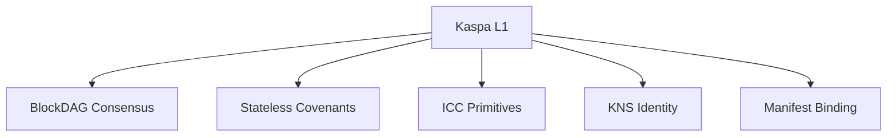

**Justification:** Keeping L1 stateless and loop-free bounds its validation cost to transaction size, which preserves throughput and predictability. Pushing all stateful, iterative, or gas-metered logic to Subnets means L1 never has to make trade-offs between expressiveness and determinism — it simply anchors and verifies what Subnets produce.

---

## 4. ICC — Inter-Covenant Communication

ICC is a delegation mechanism rather than a contract call. Its logic can be summarized as: a transition is valid only when a specified foreign transition is also present and shaped as expected.

### ICC Primitives

- `id.co_spent()` — requires covenant presence
- `observes` — inspects foreign covenant inputs/outputs
- `emits` — declares an authorized output shape
- `become` — designates a successor actor
- `actor_type<State>` — a dynamic ICC handle

### ICC Types

- **Closed ICC** — a fixed dependency on known actors
- **Open ICC** — dynamic dispatch over actor templates

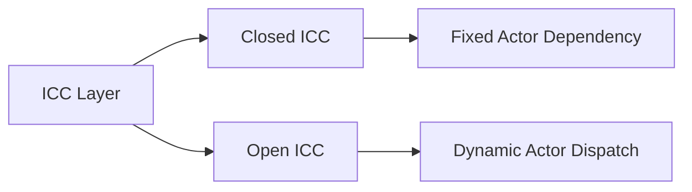

**Justification:** Expressing cross-contract dependencies as a shape-and-presence check, rather than as a synchronous call, allows covenants to remain stateless while still enforcing conditional logic across multiple actors. Closed ICC gives strict, auditable dependencies for security-critical paths, while Open ICC allows flexible dispatch for applications that need to interact with a class of actors rather than one specific instance.

---

## 5. Argent — Actor Language

Argent is a high-level language for building covenant applications. It provides:

- State definitions
- Actor ownership
- Entry transitions
- `emits` output declarations
- `become` successor logic
- ICC primitives (`observes`, `co_spent`)
- Virtual slots
- Hidden ABI state
- Route families

Argent compiles to Subnet bytecode (WASM), not to Silverscript.

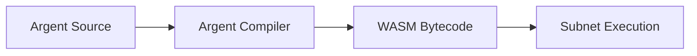

**Justification:** Compiling Argent to WASM rather than to the L1 Silverscript instruction set keeps stateful, Turing-complete application logic entirely within the Subnet layer, where gas metering and parallel execution are available, while leaving L1 free of any obligation to interpret application-specific bytecode.

---

## 6. Execution Architecture: Silverscript L1 & Argent VM

Kaspa Web uses a dual-engine execution model, splitting responsibilities between a minimal L1 validator and a full-featured Subnet execution environment.

### 6.1 L1 Execution — Silverscript VM

Silverscript is Kaspa's native, Turing-incomplete L1 scripting engine.

**Properties:** loop-free, recursion-free, zero-gas (execution cost equals transaction size only), deterministic, and stateless.

**Responsibilities:**
- Validate identity claims (KNS)
- Verify covenant transitions
- Validate ICC commitments
- Verify ZK/fraud proofs submitted by Subnets
- Lock and slash collateral via Bonding Covenants

**Core opcodes:** `OP_COV_INPUT`, `OP_COV_OUTPUT`, `OP_CO_SPENT`, `OP_OBSERVE_INPUT`, `OP_OBSERVE_OUTPUT`, `OP_VALIDATE_TEMPLATE`, `OP_VERIFY_ZK_PROOF` (a native precompile for constant-time zero-knowledge proof verification), and `OP_VERIFY_MERKLE_PATH` (a native precompile for loop-free Merkle membership verification).

### 6.2 Subnet Execution — Argent VM (WASM)

Argent compiles to WASM for Subnet execution.

**Properties:** Turing-complete, stateful, gas-metered, actor-oriented, and parallelizable.

**Responsibilities:**
- Execute Domain-Contracts
- Manage Storage Mesh logic
- Run ICC Indexers
- Process KTRUST reports
- Execute governance logic
- Run AI agents
- Maintain state roots and validity proofs

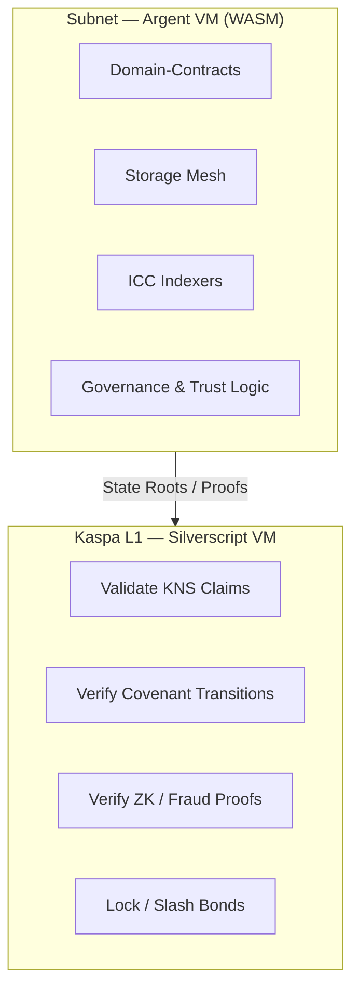

**Justification:** Separating a minimal, zero-gas validation layer from a fully expressive, gas-metered execution layer allows Kaspa Web to keep its settlement layer simple and cheap to validate, while still supporting arbitrarily complex application logic. The Subnet layer only ever needs to submit compact proofs and state roots to L1, rather than replaying full execution, which keeps L1 verification cost bounded regardless of Subnet complexity.

---

## 7. Domain-Contracts

Domain-Contracts are autonomous actors running in Subnets. They provide domain ownership, permissions, governance, storage policies, trust integration, indexing integration, and support for extensions and plugins.

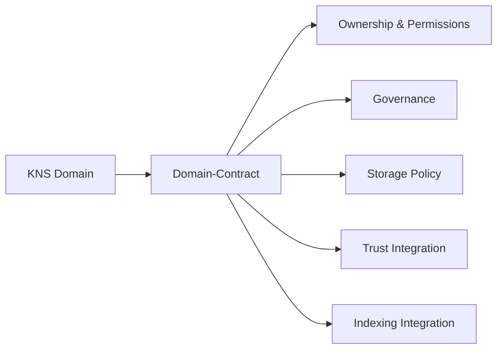

**Justification:** By running as Subnet actors rather than static records, Domain-Contracts can enforce their own rules continuously rather than only at the moment of a transaction, allowing a domain to behave as a persistent application rather than a fixed pointer.

Domain-Contracts require ICC expansion, Subnet execution, hidden ABI state, route-family commitments, and hard-fork activation before they are available on mainnet.

---

## 8. Trust Layer (KTRUST) — Slashing Model

KTRUST is a decentralized trust mechanism designed to solve a specific limitation: proof-of-work networks cannot slash funds without a deterministic proof of misbehavior.

### Slashing Architecture

1. **Bond Locking (L1):** Validators and storage providers lock KAS inside an L1 Bonding Covenant.
2. **Optimistic Challenge Window (L2):** Subnets monitor for misbehavior such as fraud, data loss, or incorrect indexing.
3. **Fraud Proof Submission (L1):** A verifier submits a ZK proof or a deterministic fraud proof to the L1 covenant.
4. **Automatic Slashing (L1):** The Silverscript VM verifies the proof; if valid, the bond is burned or awarded to the reporter.

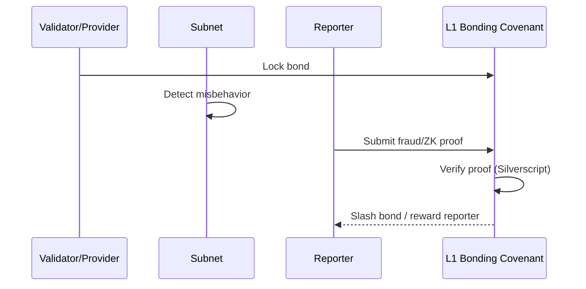

**Justification:** Anchoring the actual slashing decision in a deterministic L1 covenant, rather than in Subnet-level consensus, means the punishment mechanism inherits the same security guarantees as the base chain, even though misbehavior detection happens off-chain in the Subnet layer.

**Incentives:** Validators earn KAS for correct behavior, malicious actors are slashed, and trusted domains gain indexing priority.

---

## 9. Storage Layer — IPFS + Storage Mesh

**IPFS** provides decentralized content addressing but no persistence guarantees on its own.

**Storage Mesh** (Subnet-based) adds incentivized pinning, replication contracts, availability proofs, slashing for data loss, storage governance, and treats storage providers as first-class actors.

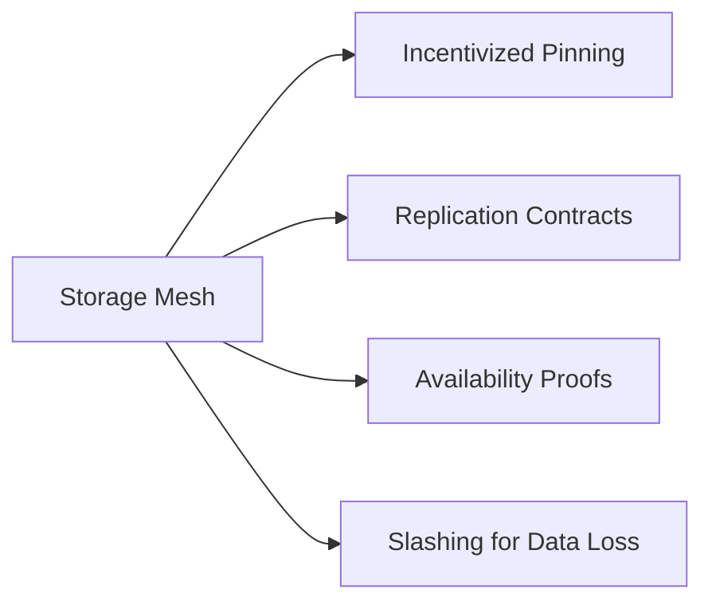

**Justification:** IPFS's content-addressing guarantees integrity but not availability, since nothing obligates any node to keep pinning a given object. Wrapping storage providers in Subnet contracts with bonds and availability proofs converts storage from a voluntary act into an economically enforced service.

**Incentives:** Storage providers earn KAS, the mesh ensures long-term availability, and domains can pay for guaranteed storage tiers.

---

## 10. ICC Indexers

Indexers are Subnet actors responsible for domain registry scanning, manifest mapping, trust mapping, storage mapping, and deterministic queries.

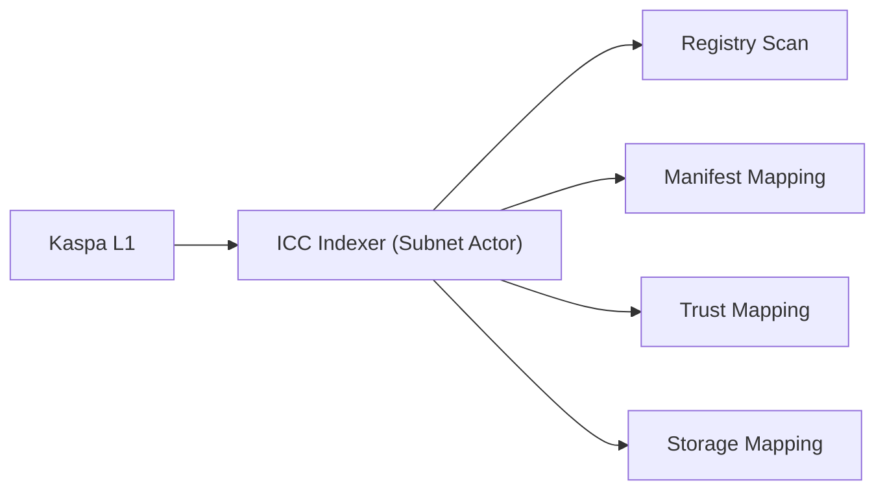

**Justification:** Running indexing as a Subnet actor rather than as a private off-chain service means indexing results are themselves subject to gas metering, bonding, and slashing — an indexer that returns incorrect results faces the same economic consequences as any other misbehaving actor.

**Incentives:** Indexers earn KAS for queries and uptime, and are slashed for incorrect results.

---

## 11. Governance & Voting

Governance contracts provide proposal creation, voting execution, quorum enforcement, cooling periods, and domain-contract update mechanisms.

**Voting models:** stake-weighted, trust-weighted, domain-owner voting, and community voting.

**Justification:** Supporting multiple voting models rather than a single fixed scheme allows different classes of decisions — protocol parameters, individual domain governance, or community initiatives — to use the weighting mechanism best suited to their stakeholders, rather than forcing all decisions through one model.

---

## 12. User Roles

Visitor, Reader, Reporter, Verifier, Trust Participant, Storage Provider, Agent.

---

## 13. Domain Owner Roles

Owner, Admin, Controller, Storage Controller, Trust Delegate, Governance Participant.

---

## 14. Subnets — Stateful Execution Layer

Subnets provide stateful actors, parallel execution, multi-actor logic, storage contracts, trust contracts, governance contracts, indexers, and AI agents. Communication with L1 occurs through ICC commitments, validity proofs, fraud proofs, state roots, and checkpointing.

### State Verification & Data Availability (DA)

To guarantee that fraud proofs and slashing remain possible even under adversarial Subnet conditions, Kaspa Web uses L1 Data Availability anchoring:

- Validity proofs (ZK) or fraud proofs (optimistic) are anchored directly onto Kaspa L1.
- Subnets periodically commit their state roots and compressed transaction metadata (diffs) into dedicated L1 payload fields.
- These commitments allow any external verifier to reconstruct the relevant Subnet state history needed to produce a valid fraud proof, even if malicious Subnet validators attempt state withholding.
- To avoid L1 propagation delays on Kaspa's high-BPS BlockDAG, DA commits are batched into epoch-based intervals, compressed via state differentials, and subject to an L1 storage-fee premium to discourage state bloat.
- The Silverscript VM verifies the fraud proof deterministically, enabling automatic slashing of the bond stored in the L1 Bonding Covenant.

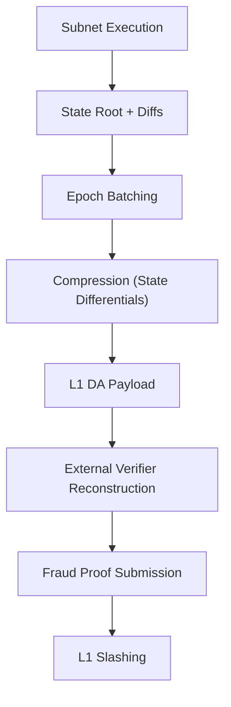

**Justification:** Without a data availability guarantee, a malicious Subnet operator could withhold the data needed to construct a fraud proof, making slashing unenforceable in practice even if the mechanism exists on paper. Anchoring compressed state diffs on L1, on a schedule designed not to interfere with block propagation, closes this gap while bounding the cost of doing so.

---

## 15. Concurrency Model — Hybrid Architecture

Kaspa Web uses two distinct concurrency models, one per layer.

### 15.1 L1 Concurrency — UTXO Parallelism

Used for KNS domain registration, identity updates, and stateless ICC transitions. Mechanism: UTXO splitting, UTXO chaining, and parallel validation via GHOSTDAG.

### 15.2 Subnet Concurrency — Stateful Actor Model

Used for Domain-Contracts, Storage Mesh, indexers, governance, and trust logic.

- **Partitioned actors:** each domain has its own execution thread.
- **Read/write sets:** transactions declare which virtual slots they access.
- **Parallel reads:** unlimited parallel read-only operations.
- **Serialized writes:** writes to the same actor are serialized to prevent race conditions.

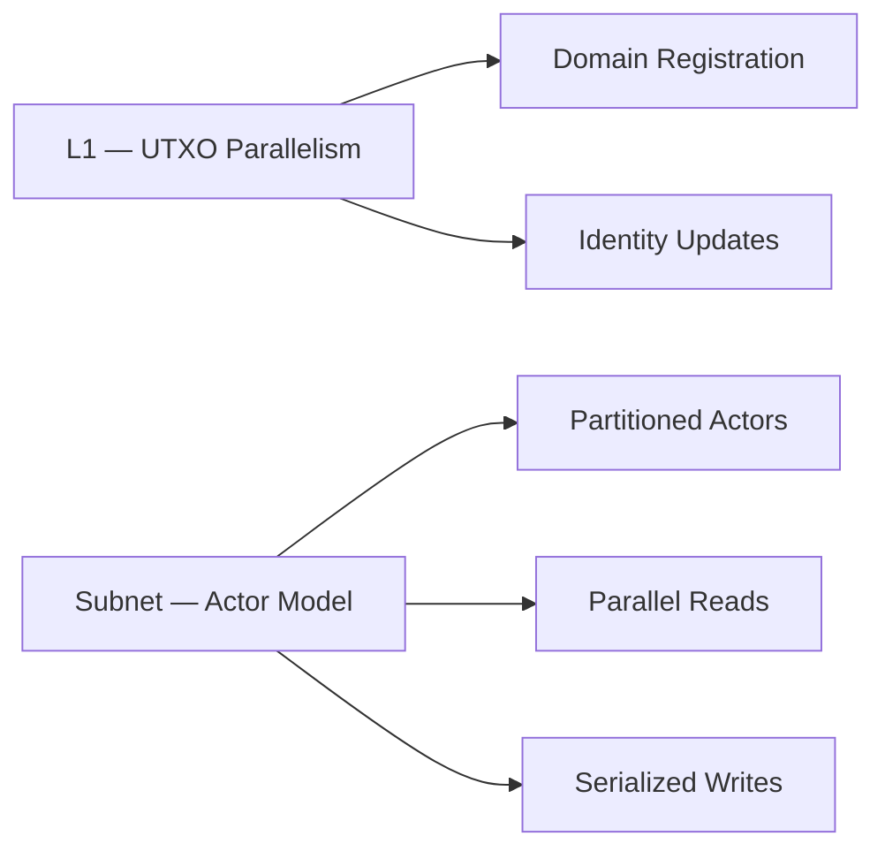

**Justification:** L1 and Subnets have different concurrency needs: L1 transactions are largely independent and benefit from UTXO-style parallelism, while Subnet actors maintain persistent state and require write serialization per actor to avoid race conditions, while still allowing unrestricted parallel reads.

---

## 16. Tokenomics, Gas & Slashing Mechanics

### 16.1 Gas Mechanics

- **L1:** no gas; fee is determined solely by transaction size.
- **Subnets:** gas is required for execution, storage, indexing, trust validation, governance, and AI agent operations.

### 16.2 Slashing Mechanics

Bonds are locked on L1; fraud proofs are submitted to L1; Silverscript verifies the proofs; slashing is automatic upon a valid proof.

**Justification:** Keeping L1 gas-free and tying it only to transaction size preserves its role as a lightweight settlement and validation layer, while metering gas at the Subnet level ensures that the cost of stateful, expressive computation is borne by the applications that actually use it.

---

## 17. Security Model

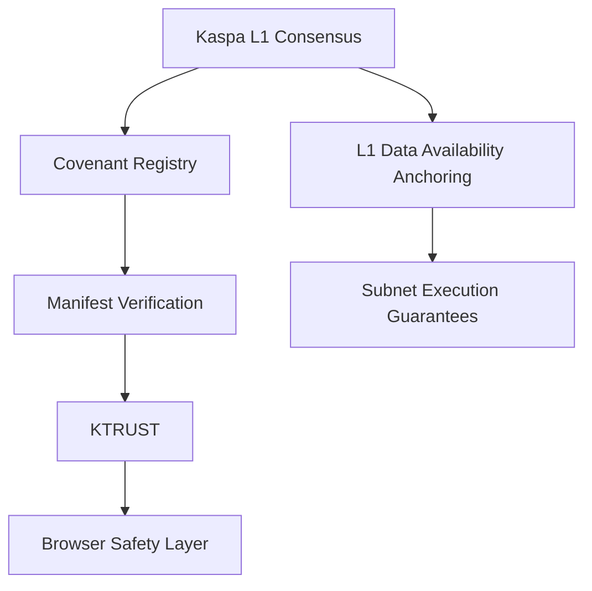

**Justification:** Security is distributed across seven layers rather than concentrated in any single mechanism. Consensus and DA anchoring provide the foundation; the covenant registry and manifest verification guarantee domain and content integrity; KTRUST and Subnet execution guarantees extend those properties into the trust and application layers; and the browser safety layer is the final checkpoint before content reaches a user. A weakness in any one layer does not, by itself, compromise the guarantees provided by the layers beneath it.

---

## 18. Roadmap

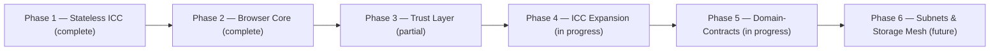

---

## 19. Future Outlook

Kaspa Web is designed to evolve into a decentralized internet stack in which domains are contracts, websites are trust-minimized, storage and indexing are decentralized, governance is open, ICC underlies all logic, Subnets provide scalable execution, and Data Availability anchoring underwrites fraud-proof, censorship-resistant verification — anchored throughout by the Kaspa BlockDAG.
