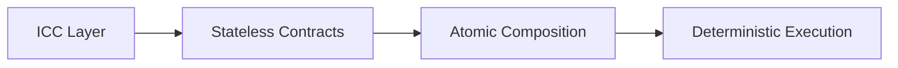
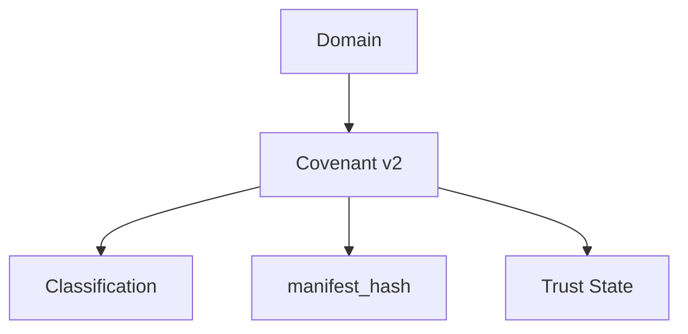
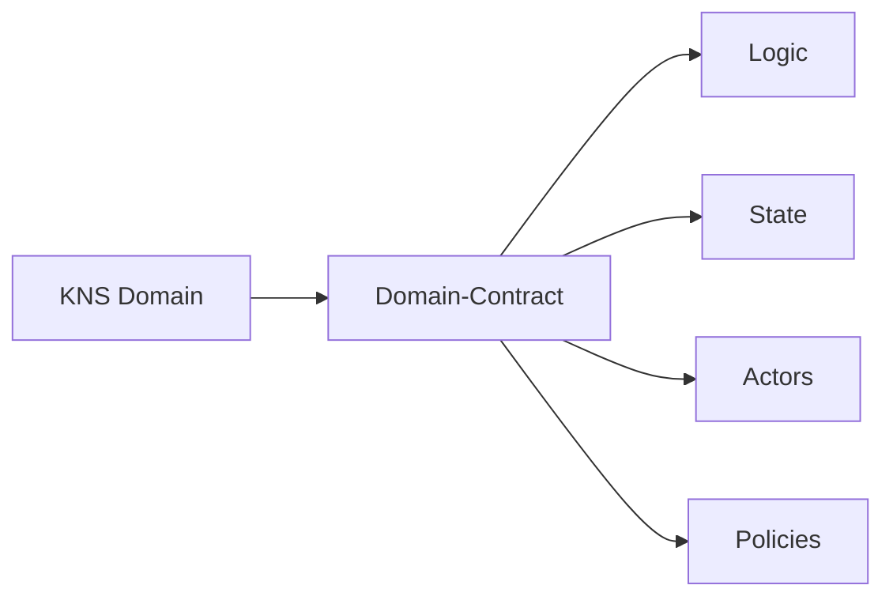
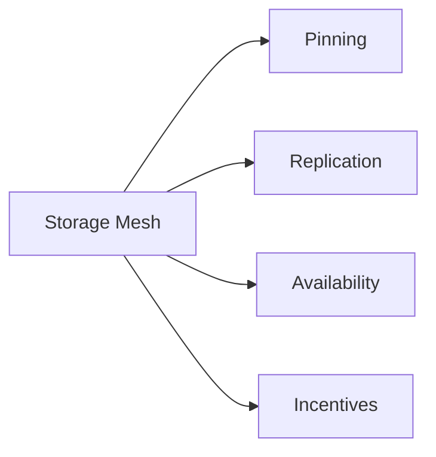
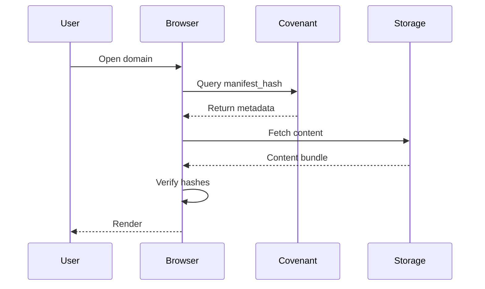
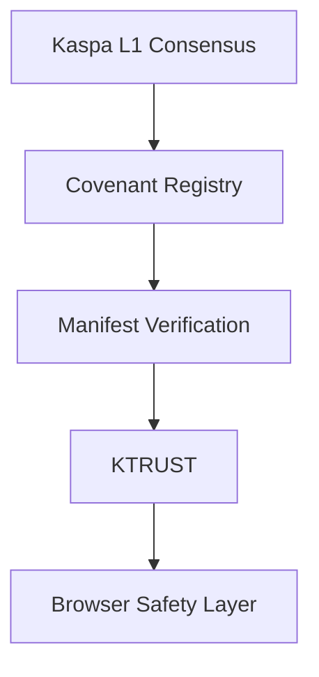
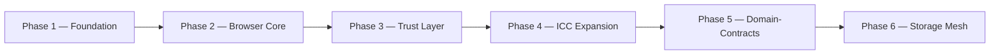

# 🟢⚫ KASPA WEB  
### Decentralized Internet Protocol  
**Whitepaper v2.0 — Protocol Architecture & Future Upgrade Path**

---

## 1. Executive Summary

Kaspa Web is a decentralized internet protocol built natively on top of the Kaspa BlockDAG. It defines an architecture through which domains, content, identity, and trust can exist entirely on-chain and off-chain in a cryptographically verifiable manner, without reliance on centralized hosting providers, certificate authorities, or DNS registries.

The protocol is composed of a set of interlocking layers: an Inter-Contract Communication (ICC) layer that governs deterministic contract behavior, a Covenant-based domain logic layer, a manifest-driven content-binding mechanism, a distributed storage layer referred to as the Storage Mesh, and a trust layer that provides reputation and safety signaling to end users.

This document presents Protocol Architecture v2.0, which extends the existing Covenant-based model with a forward path toward fully autonomous Domain-Contracts. This upgrade path depends on a formal Request for Comments (RFC) process and an expanded ICC specification, both of which are necessary preconditions for the advanced functionality described in later sections. Where functionality depends on this future upgrade, it is explicitly marked as such throughout the document.

---

## 2. Vision & Problem Statement

The traditional web is structured around centralized control points: domain registrars, certificate authorities, hosting providers, and content delivery networks. Each of these represents a point of failure, censorship, or unilateral control. A domain can be seized, a certificate can be revoked, a host can remove content, and a registrar can deny renewal — all without the consent of the domain's owner or its users.

Kaspa Web's mission is to remove these centralized control points by anchoring domain ownership, content integrity, and trust signaling directly to Kaspa's BlockDAG. In this model:

- Domain ownership is enforced by consensus rather than by a registrar's database.
- Content integrity is enforced by cryptographic hashing rather than by a hosting provider's assurances.
- Trust is enforced by an on-chain reputation mechanism rather than by a centralized certificate authority.

The result is an internet layer in which no single entity can unilaterally alter, seize, or censor a domain that has been correctly registered and maintained by its owner.

---

## 4. Technical Architecture v2.0

### 4.1 ICC — Inter-Contract Communication

Inter-Contract Communication (ICC) is the deterministic contract physics layer underlying Kaspa Web. ICC defines the rules by which a stateless contract (a Covenant-bound UTXO) may transition into a successor state, and by which multiple contracts may compose their behavior atomically within a single transaction context.

ICC does not introduce a general-purpose virtual machine or global mutable state. Instead, it defines a constrained set of primitives — dependency assertions, observation rules, emission rules, and state-transition rules — that allow contracts to reference and react to one another while preserving Kaspa's stateless, UTXO-based validation model.

**Justification:** Because Kaspa's consensus layer validates transactions statelessly and in parallel across a BlockDAG, any mechanism for inter-contract behavior must avoid introducing global state or non-deterministic ordering. ICC satisfies this constraint by expressing all contract relationships as verifiable conditions evaluated at the level of individual transactions, allowing multiple stateless contracts to compose into higher-order behavior — such as a domain-and-registry relationship — without compromising parallel validation or introducing consensus-level ambiguity.

### 4.2 Covenant v2 — ICC-Powered Domain Logic

Covenant v2 represents a domain's on-chain logic as an ICC-aware contract. Rather than being a static spending condition, a Covenant v2 UTXO carries structured state — classification, manifest binding, and trust metadata — that is enforced and updated according to ICC's deterministic transition rules.

**Justification:** Binding classification, content reference, and trust state directly into the Covenant structure ensures that a domain's identity, its published content, and its reputation are all enforced by the same consensus mechanism, rather than by separate, loosely coupled systems. This reduces the attack surface for spoofing or inconsistency between what a domain claims to be and what it is verifiably bound to on-chain.

### 4.3 Domain-Contracts (Future L1 Upgrade)

Domain-Contracts represent the long-term evolution of Covenant v2 into fully autonomous, programmable domain entities. Where a Covenant v2 UTXO carries state and classification, a Domain-Contract additionally carries its own logic, defined actor permissions, and enforceable policies — enabling a domain to behave as a self-governing on-chain entity rather than a passive record.

**Justification:** A static Covenant is sufficient to bind identity and content, but it cannot express conditional behavior, multi-party governance, or programmable policy enforcement at the domain level. Domain-Contracts extend the model so that a domain can encode its own rules of operation — for example, multi-signature update policies or delegated publishing rights — directly into consensus-enforced logic. This capability requires execution semantics beyond what the current Covenant model supports, and is therefore dependent on the RFC and ICC expansion described in Section 5.

### 4.4 RFC — Protocol Evolution Mechanism

The Request for Comments (RFC) process is the formal specification mechanism through which changes to Kaspa Web's protocol-level behavior are proposed, reviewed, and ratified. An RFC defines the precise semantics, validation rules, and backward-compatibility guarantees of a proposed change before it is considered for activation.

**Justification:** Because Domain-Contracts and related capabilities require changes to consensus-level validation logic, they cannot be safely introduced through informal iteration. The RFC process ensures that any expansion of ICC's primitive set, or any new contract semantics introduced at L1, is subject to rigorous technical review, compatibility analysis, and community consensus prior to activation — consistent with how base-layer protocol changes are handled in mature blockchain systems.

---

## 5. Protocol Upgrade Notice — RFC + ICC Required

Full Domain-Contract functionality requires waiting for the upcoming RFC + ICC upgrade and a coordinated hard-fork.

The architecture described in Sections 4.3 and 6.3 depends on protocol-level capabilities that do not yet exist in the current specification. Until the corresponding RFC is formally ratified and the associated ICC expansion is activated through a coordinated hard-fork, Domain-Contracts and the full Storage Mesh incentive layer remain forward-looking design targets rather than deployable functionality. Covenant v2, manifest binding, and the current Storage Layer architecture described in Section 6 remain functional under the existing protocol.

---

## 6. Storage Layer Architecture v1.1

### 6.1 On-Chain Binding

Each domain's Covenant carries a `manifest_hash` — a single cryptographic commitment representing the complete set of content associated with that domain. The `manifest_hash` is a Merkle root computed over a structured manifest describing every file belonging to the site, along with per-file hashes and one or more storage pointers for retrieval.

Because only the `manifest_hash` is bound on-chain, the size of a domain's content has no bearing on-chain footprint: a single fixed-size commitment secures an arbitrarily large content set, while retrieval and verification of the underlying files occur off-chain.

### 6.2 Off-Chain Storage Sources

Content referenced by a manifest may be retrieved from any combination of the following sources:

- **IPFS** — content-addressed peer-to-peer storage.
- **Storage Mesh** — Kaspa Web's native distributed hosting layer (see Section 6.3).
- **Signed Bundles** — pre-packaged, cryptographically signed archives distributed independently of a live network.
- **HTTP Fallback** — conventional web hosting used as a retrieval path of last resort, still subject to hash verification against the on-chain manifest.

Because every retrieval path is verified against the same `manifest_hash`, no storage source is trusted implicitly; each is merely a candidate location from which verifiably correct content may be obtained.

### 6.3 Kaspa Storage Mesh (Future RFC)

The Storage Mesh is a proposed decentralized hosting layer purpose-built for Kaspa Web content. It is designed to provide durable availability for manifest-bound content without relying on a single hosting operator.

**Justification:** Content addressing alone guarantees integrity but not availability — a manifest hash can verify that retrieved content is correct, but it cannot ensure that a copy of the content exists anywhere to be retrieved. The Storage Mesh addresses this by introducing pinning commitments, replication across independent operators, availability attestations, and an incentive mechanism that rewards operators for maintaining verifiable uptime. As with Domain-Contracts, the incentive and slashing logic underlying this layer requires the RFC-defined ICC expansion described in Section 5 before it can be enforced at the protocol level.

### 6.4 Verification Pipeline

This pipeline ensures that no content is rendered to a user until it has been cryptographically verified against the on-chain commitment associated with the requested domain, regardless of which storage source ultimately served the content.

---

## 7. Security & Integrity Model v2.0

Kaspa Web's security model is layered, with each layer providing an independent guarantee that narrows the space of possible integrity failures as content moves from consensus down to the end user.

Kaspa L1 Consensus establishes the base layer of truth: which domain exists, who owns it, and what its current `manifest_hash` is. The Covenant Registry enforces the structural rules governing how a domain's Covenant may transition between states. Manifest Verification ensures that retrieved content matches its on-chain commitment byte-for-byte. KTRUST provides a reputation signal that reflects a domain's historical behavior and community-reported classification. The Browser Safety Layer is the final checkpoint at which all prior guarantees are surfaced to the end user before content is rendered.

Each layer is independently verifiable, so a failure or compromise at any single layer does not silently propagate — a browser client can, in principle, re-derive every guarantee above it from first principles rather than trusting an intermediary's assertion.

---

## 8. Identity & Ownership v2.0

Domain identity in Kaspa Web is anchored to Kaspa L1 through the Kaspa Name Service (KNS) and is enforced by the same consensus mechanism that secures the underlying UTXO set. Ownership of a domain corresponds directly to control of its associated Covenant, meaning that transfer, renewal, and revocation follow the same cryptographic rules as any other on-chain asset transfer.

Unlike traditional domain registration, there is no renewal authority capable of unilaterally reclaiming a domain outside the rules encoded in its Covenant. A domain's lifecycle — registration, update, transfer, or expiration — is fully determined by protocol rules rather than by the discretion of a registrar.

---

## 9. Governance & Evolution v2.0

Kaspa Web distinguishes between two distinct governance domains:

- **Protocol Governance** governs changes to the base-layer rules themselves — ICC primitives, Covenant semantics, and consensus-level validation logic. Changes at this level proceed exclusively through the RFC process described in Section 4.4, culminating in coordinated activation where required.

- **Application Governance** governs behavior within the bounds of existing protocol rules — for example, how an individual Domain-Contract's actor permissions or policies are configured by its owner. This layer of governance operates entirely within the flexibility already granted by ratified protocol rules and does not require a protocol-level upgrade.

This separation ensures that experimentation and customization at the application layer can proceed freely, while changes that affect the security or determinism of the base protocol remain subject to rigorous, deliberate review.

---

## 10. Roadmap v2.0

- **Phase 1 — Foundation:** Establish Covenant v2, manifest binding, and KNS-based domain identity on existing L1 primitives.
- **Phase 2 — Browser Core:** Deliver a reference client capable of resolving domains, retrieving manifests, and performing hash verification.
- **Phase 3 — Trust Layer:** Introduce KTRUST reputation signaling and integrate it into the browser safety layer.
- **Phase 4 — ICC Expansion:** Formalize and ratify the RFC required to extend ICC primitives beyond current Covenant semantics.
- **Phase 5 — Domain-Contracts:** Activate autonomous domain logic, actor permissions, and policy enforcement following coordinated hard-fork.
- **Phase 6 — Storage Mesh:** Deploy incentive-secured pinning and replication as a native decentralized hosting layer.

---

## 11. Future Outlook

Kaspa Web's long-term trajectory is toward an internet layer in which domain ownership, content integrity, and trust are properties of consensus rather than properties of institutional trust. As ICC expands and Domain-Contracts become available, domains can evolve from static, owner-controlled records into programmable entities capable of expressing their own governance, access policies, and multi-party logic — all while remaining anchored to the same stateless, high-throughput consensus that secures the underlying Kaspa network.

This evolution is deliberately incremental. Each phase of the roadmap is designed to preserve backward compatibility with domains and content established under earlier phases, ensuring that the protocol's growth does not come at the cost of continuity for its earliest participants.
