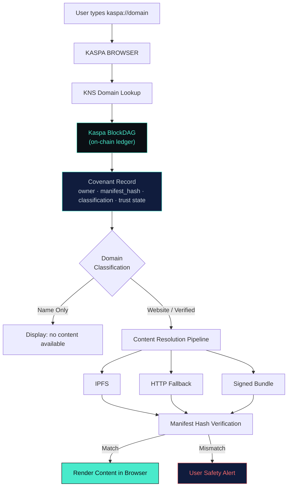
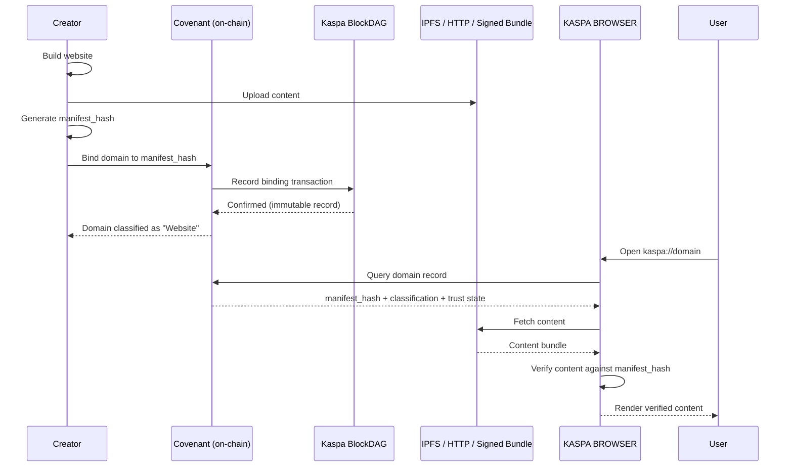
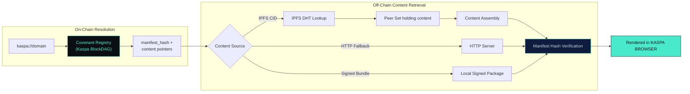
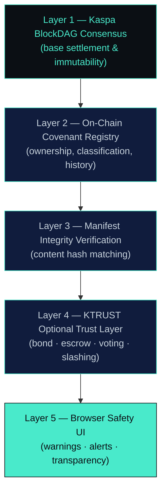
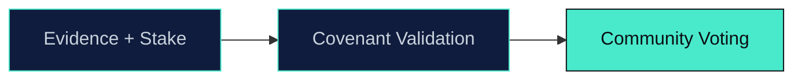
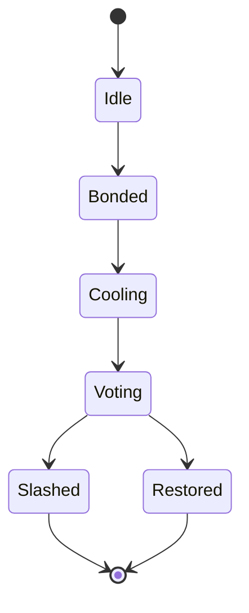
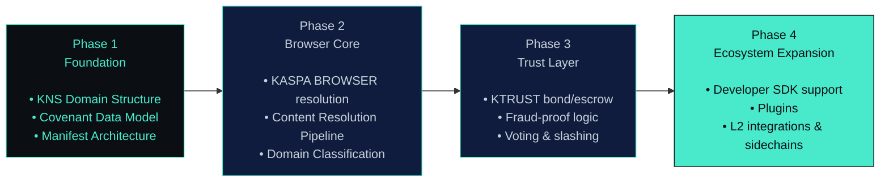

<!--
============================================================
 KASPA WEB — Decentralized Internet Protocol on the Kaspa DAG
 Whitepaper (Markdown master file)
 Ready for conversion to PDF via Canva / LaTeX / InDesign
============================================================
-->

<div align="center">

# 🟢⚫ KASPA WEB
### A Decentralized Internet Protocol Built on the Kaspa BlockDAG

**Whitepaper — Documentation & Technical Architecture**

*KASPA BROWSER · KNS Domains · Covenant Protocol · KTRUST*

---

**Version 1.0 — Community Edition**
**Palette:** Kaspa Green `#49EACB` · Deep Black `#0B0F14` · Steel Silver `#C7D2DC` · Midnight Blue `#101C3D`
**Visual motifs:** BlockDAG lattices, interconnected nodes, block-graph textures, glowing directed edges

</div>

<div style="page-break-after: always;"></div>

## 📑 Table of Contents

1. [Executive Summary](#1-executive-summary)
2. [Vision & Problem Statement](#2-vision--problem-statement)
3. [Technical Architecture](#3-technical-architecture)
4. [Security & Integrity Model](#4-security--integrity-model)
5. [Identity & Ownership](#5-identity--ownership)
6. [Incentive & Governance](#6-incentive--governance)
7. [Roadmap](#7-roadmap)
8. [Future Outlook & Mission](#8-future-outlook--mission)
9. [Disclaimer](#9-disclaimer)
10. [Appendix — Visual Identity Guide](#10-appendix--visual-identity-guide)

<div style="page-break-after: always;"></div>

## 1. Executive Summary

The Kaspa decentralized web ecosystem introduces a new way to publish, verify, and access websites — without centralized registrars, without private indexers, and without rented identities.

**KASPA BROWSER** and **KTRUST** together form the foundation of this ecosystem: a free internet where domains are permanent, content is cryptographically verified, and trust is optional and decentralized. Domains are resolved through **KNS (Kaspa Name Service)**, given meaning through an on-chain logic layer called the **Covenant**, and — optionally — reinforced with community-driven trust signals through **KTRUST**.

This document consolidates the protocol's documentation and technical appendix into a single whitepaper, organized around architecture, security, identity, governance, and roadmap.

> This is a high-level architectural whitepaper. It describes the design and mechanisms of the protocol as currently specified; it does not constitute a guarantee of features, timelines, or outcomes beyond what is explicitly described.

<div style="page-break-after: always;"></div>

## 2. Vision & Problem Statement

### 2.1 The Vision

Our mission is simple:

> *"To build an internet where identity, access, and trust belong to the people — not corporations, registrars, or centralized authorities."*

No gatekeepers. No surveillance. No "Big Brother." Just pure digital freedom.

### 2.2 The Problem with the Traditional Web

The traditional web depends on centralized registrars to issue and revoke domains, on private indexers to determine what is discoverable, and on opaque trust systems controlled by single entities. Ownership is rented, not owned — and can be reassigned or revoked outside the user's control.

### 2.3 KNS Domains

**KNS domains are permanent decentralized names.** They are not rented, not leased, and not controlled by any registrar. On their own, they are simple identifiers — until the **Covenant** gives them meaning.

### 2.4 Traditional Web vs. Kaspa Web

| Dimension | Traditional Web | Kaspa Web |
|---|---|---|
| Domain ownership | Rented from a registrar, expires periodically | Permanent, on-chain, immutable ownership |
| Discovery | Private, centralized indexers | Direct on-chain verification, no private indexers |
| Content binding | Server-controlled, mutable at will | Bound to a cryptographic `manifest_hash` |
| Trust model | Centralized certificate authorities / platform trust badges | Optional, decentralized trust layer (KTRUST) |
| Classification | Implicit, platform-defined | Explicit Covenant classification (Name / Website / Verified / Reported / Historical) |
| Safety signals | Centralized moderation, opaque blocking | Warnings, alerts, history, transparency — without blocking content |
| Governance | Corporate or registrar-controlled | Community proposals and decentralized voting |

<div style="page-break-after: always;"></div>

## 3. Technical Architecture

### 3.1 Core Principles of the Browser

- Direct on-chain verification
- No private indexers
- Covenant-based classification
- Decentralized content loading
- Built-in trust indicators
- User safety alerts
- Cryptographic guarantees
- Open-source ecosystem

### 3.2 The Covenant — An Automated Judge

The **Covenant** is the logic layer that transforms a KNS domain from "just a name" into:

- A real website
- A verified domain
- A domain with history
- A domain with trust signals
- A domain with content binding

It acts as an automated judge that tells the browser exactly what the domain represents, answering:

- Is this domain just a name?
- Does it contain real website content?
- Does it have optional trust features (KTRUST\*)?
- Does it have reports or history?

*\* KTRUST is optional — not required.*

### 3.3 Domain Classification

The browser understands domains through Covenant signals:

| Classification | Description |
|---|---|
| Name Only | No content |
| Website | `manifest_hash` present |
| Verified | Optional KTRUST badge |
| Reported | Pending issues |
| Historical | Past events |

### 3.4 KNS Domain Structure

Permanent identifiers stored on-chain. Immutable ownership. No expiration.

### 3.5 Manifest Architecture

The manifest contains:

- File list
- Content hashes
- Metadata
- Versioning

It is bound to the domain via `manifest_hash`.

### 3.6 Covenant Data Model

The Covenant stores:

- Owner
- `manifest_hash`
- Classification
- Trust state
- Reports
- History

### 3.7 Content Loading Model

Content is loaded from:

- IPFS
- HTTP fallback
- Signed bundles

The browser verifies content against the manifest hash.

### 3.8 Architecture Diagram — `kaspa://` Protocol Flow



### 3.9 Content Upload & Verification Flow



### 3.10 Address Resolution & Content Retrieval

Domain resolution separates **on-chain lookup** (who owns the domain, and what manifest it is bound to) from **off-chain content retrieval** (where the actual files live). IPFS content retrieval relies on a distributed hash table (DHT) to locate peers holding the content referenced by the manifest's content hashes.



### 3.11 Content Resolution Pipeline (Summary)

```
Domain → Covenant → manifest_hash → Content Source → Verification → Rendering
```

### 3.12 Browser Verification Flow

The browser checks:

- Ownership
- Manifest integrity
- Trust signals
- Report status
- History

<div style="page-break-after: always;"></div>

## 4. Security & Integrity Model

### 4.1 Security Guarantees

- Cryptographic verification
- Tamper-proof metadata
- Spoofing protection
- Decentralized trust
- No centralized infrastructure

### 4.2 User Safety Layer

The browser provides:

- Warnings
- Alerts
- History
- Transparency

...without blocking content.

### 4.3 Security Layers Stack



### 4.4 KTRUST — Optional Trust Layer

KTRUST is optional, not required. It adds:

- Bond deposit
- ESCROW
- Cooling-off
- Slashing
- Restoration
- Verified badge

### 4.5 Trust Indicators

| Indicator | Meaning |
|---|---|
| **Unverified** | Standard decentralized domain |
| **Verified\*** | Optional trust badge |

*\* Verified comes from KTRUST.*

### 4.6 Fraud-Proof Logic (High-Level)



### 4.7 ESCROW State Machine (High-Level)



### 4.8 Voting & Slashing (High-Level)

- 51% consensus required
- Automatic slashing
- Automatic restoration

<div style="page-break-after: always;"></div>

## 5. Identity & Ownership

### 5.1 Permanent, Immutable Identity

KNS domains are permanent identifiers stored on-chain, with immutable ownership and no expiration. They are not rented, not leased, and not controlled by any registrar.

### 5.2 The Covenant as an Identity Record

The Covenant Data Model stores everything that gives a domain its identity and standing:

| Field | Purpose |
|---|---|
| Owner | On-chain proof of control |
| `manifest_hash` | Binds the domain to specific verified content |
| Classification | Name / Website / Verified / Reported / Historical |
| Trust state | Reflects KTRUST status, if opted into |
| Reports | Pending issues raised by the community |
| History | Full record of past events |

### 5.3 From Name to Website — The Full Lifecycle

**Creator Side**
1. Builds website
2. Uploads content
3. Generates `manifest_hash`
4. Binds domain via Covenant
5. Domain becomes a real website

**User Side**
1. Opens KASPA BROWSER
2. Types domain
3. Browser queries Covenant
4. Browser loads content
5. User browses in true freedom

<div style="page-break-after: always;"></div>

## 6. Incentive & Governance

### 6.1 Governance & Evolution

The ecosystem evolves through:

- Community proposals
- Decentralized voting
- Transparent updates

### 6.2 Developer Ecosystem

Developers get:

- Stable domain resolution
- Predictable metadata binding
- Unified content pipeline
- Future SDK support

### 6.3 Incentive Alignment via KTRUST

KTRUST's bond-and-escrow design (Section 4.4) creates an economic incentive for accurate, honest domain behavior: participants who opt in stake a bond that can be restored or slashed based on community-validated fraud-proof outcomes (Section 4.6–4.8). Because KTRUST is optional, base-layer domain ownership and resolution never depend on staking or voting outcomes.

<div style="page-break-after: always;"></div>

## 7. Roadmap

The roadmap below organizes the components already described in this document into a logical build-out sequence. It reflects architectural dependency order rather than fixed calendar commitments.



| Phase | Focus | Key Deliverables |
|---|---|---|
| Phase 1 — Foundation | Core protocol primitives | KNS domain structure; Covenant data model (owner, manifest_hash, classification, trust state, reports, history); manifest architecture (file list, content hashes, metadata, versioning) |
| Phase 2 — Browser Core | Resolution & rendering | KASPA BROWSER; content resolution pipeline (Domain → Covenant → manifest_hash → Content Source → Verification → Rendering); domain classification (Name / Website / Verified / Reported / Historical); user safety layer (warnings, alerts, history, transparency) |
| Phase 3 — Trust Layer | Optional decentralized trust | KTRUST bond deposit and ESCROW; cooling-off, slashing, and restoration states; fraud-proof logic (evidence + stake → Covenant validation → community voting); verified badge |
| Phase 4 — Ecosystem Expansion | Interoperability & growth | Developer SDK support; plugins; L2 integrations; sidechains; advanced content bundles; future trust layers |

<div style="page-break-after: always;"></div>

## 8. Future Outlook & Mission

### 8.1 Future Extensions & Interoperability

The protocol is designed for:

- SDKs
- Plugins
- L2 integrations
- Sidechains
- Advanced bundles
- Future trust layers

### 8.2 Community Call

We invite developers, creators, researchers, and dreamers:

> *"Join us. Build with us. Support open-source freedom. The decentralized internet belongs to everyone."*

### 8.3 Donation Wallet

Support the development of KTRUST and the decentralized web:

**Kaspa Donation Address:**
```
kaspa:KTRUST.KAS
```

<div style="page-break-after: always;"></div>

## 9. Disclaimer

This project is fully open-source, community-driven, and built for the purpose of enabling absolute digital freedom.

No central authority controls the domains, the trust model, or the browser. All contributions support the evolution of a free, censorship-resistant internet.

This whitepaper describes the architecture and design intent of the protocol as specified in the source documentation. It is not financial advice, and it does not guarantee specific timelines, features, or outcomes beyond what is explicitly described herein.

<div style="page-break-after: always;"></div>

## 10. Appendix — Visual Identity Guide

For designers converting this document to PDF (Canva / LaTeX / InDesign):

**Color Palette**

| Swatch | Name | Hex | Usage |
|---|---|---|---|
| 🟢 | Kaspa Green | `#49EACB` | Accents, highlights, verified badges, active states |
| ⚫ | Deep Black | `#0B0F14` | Backgrounds, cover page |
| 🔵 | Midnight Blue | `#101C3D` | Section panels, secondary backgrounds |
| ⚪ | Steel Silver | `#C7D2DC` | Body text on dark backgrounds |

**Typography**

- Headings: bold, geometric sans-serif (e.g., Inter, Space Grotesk, or Sora), 24–28pt for parts, 16–18pt for sections
- Body: clean sans-serif, 11–12pt, 1.5 line spacing

**Visual Motifs**

- BlockDAG lattice patterns (interconnected nodes with directed edges) as background textures on the cover and section dividers
- Node-and-edge graphics to represent Covenant records, peer content retrieval, and consensus
- Glowing green edges on a dark background to evoke the Kaspa network's block-graph structure
- Rounded state-pill shapes for pipeline and flow diagrams (as rendered in the Mermaid diagrams above)

**Layout**


---

<div align="center">

**KASPA WEB — Whitepaper**
*Community-Driven Open-Source Project*

</div>
