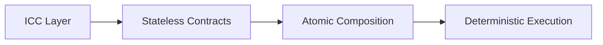
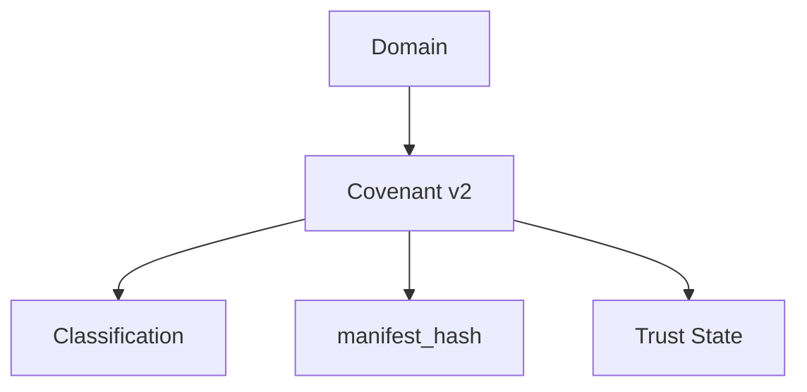
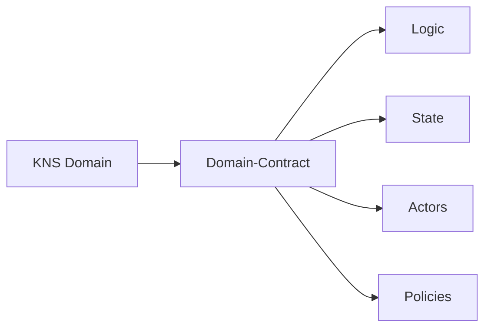
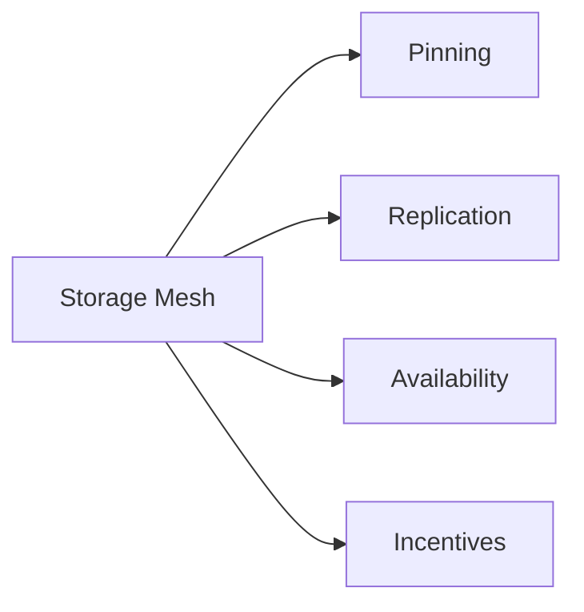
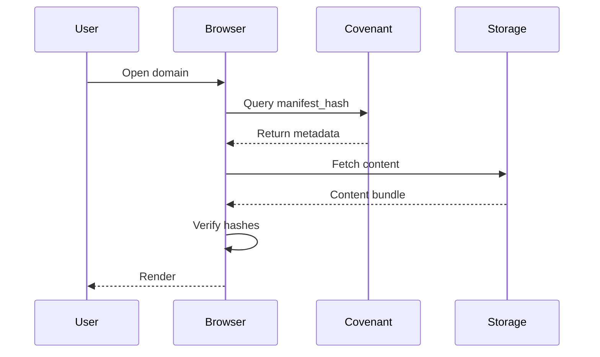
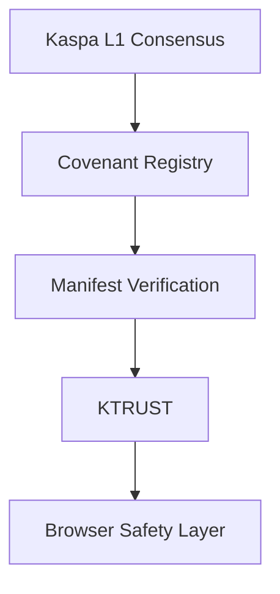
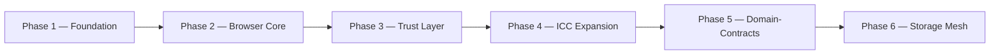

# 🟢⚫ KASPA WEB  
### Decentralized Internet Protocol  
**Whitepaper v2.0 — Protocol Architecture & Future Upgrade Path**

---

## 2. Executive Summary

Kaspa Web is a decentralized internet protocol built natively on top of the Kaspa BlockDAG. It defines an architecture through which domains, content, and trust relationships can exist in a cryptographically verifiable manner, without dependence on centralized hosting providers, certificate authorities, or traditional DNS registries.

The protocol is composed of a set of interlocking layers — Inter-Contract Communication (ICC), Covenant v2, manifest-driven content binding, a distributed storage layer, and a trust-signaling framework (KTRUST). Together, these layers allow a domain to be registered, verified, and rendered entirely from on-chain and cryptographically anchored off-chain data.

This edition of the whitepaper documents the architecture as it exists today, and describes the future upgrade path — Domain-Contracts — that will allow domains to evolve from static, passively-verified records into programmable, policy-enforcing entities. This future functionality is explicitly gated behind protocol-level changes described in Section 5.

## 3. Vision & Problem Statement

The traditional web depends on a small number of centralized control points: domain registrars that can seize or suspend names, certificate authorities that can revoke trust, and hosting providers that can remove content unilaterally. These control points create single points of failure for censorship, seizure, and service disruption.

Kaspa Web's mission is to remove these control points by anchoring domain ownership, content integrity, and trust signaling directly to Kaspa's BlockDAG. In this model, a domain's registration record, its content hash, and its trust metadata are all verifiable by any client without reliance on a trusted third party. Ownership is enforced by consensus rather than by a registrar's database, and content is validated by cryptographic hash rather than by institutional reputation.

## 4. Technical Architecture v2.0

Kaspa Web is built on a small number of composable layers, each responsible for a distinct part of the domain lifecycle: identity, logic, content binding, storage, and trust.

### 4.1 ICC — Inter-Contract Communication

ICC defines the deterministic contract physics that stateless, UTXO-based contracts on Kaspa operate under. It specifies how contracts compose, how they communicate, and how their execution remains fully deterministic without introducing global mutable state at the consensus layer.

**Justification.** Because Kaspa's consensus layer does not natively support persistent global state, any higher-order contract behavior — such as a domain referencing another domain, or a policy contract validating an action — must be expressed as a composition of stateless primitives. ICC provides the rules for that composition, guaranteeing that the outcome of any interaction between contracts is deterministic and independently verifiable by every node, without requiring a shared mutable ledger of contract state.

### 4.2 Covenant v2 — ICC-Powered Domain Logic

Covenant v2 is the mechanism by which a domain's classification, manifest hash, and trust metadata are bound directly into its on-chain identity. It is implemented as a constrained, ICC-composable contract: the covenant restricts how its own UTXO can be spent, which in turn restricts how the domain record it represents can be updated.

**Justification.** Binding classification, content hash, and trust state into a single covenant-controlled record means that any client resolving a domain can retrieve all three properties from one on-chain query, and can verify — via the covenant's spending rules — that none of them could have been altered outside of an authorized update path. This removes the need for a separate registry service to certify what a domain "is" or what it currently points to.

### 4.3 Domain-Contracts (Future L1 Upgrade)

Domain-Contracts extend the Covenant v2 model from a passive, classification-and-hash record into an active, programmable entity. Where a Covenant v2 UTXO carries state and classification, a Domain-Contract additionally carries its own logic, defined actor permissions, and enforceable policies.

**Justification.** A static covenant record is sufficient for verifying content and classification, but it cannot express multi-party governance, conditional updates, or autonomous behavior. Domain-Contracts introduce a logic layer and an actor-permission model on top of the existing covenant structure, allowing a domain to enforce rules such as "requires 2-of-3 delegate signatures to update" or "rejects interactions from domains below a trust threshold" directly at the consensus level, rather than relying on off-chain coordination that clients would have to trust blindly.

### 4.4 RFC — Protocol Evolution Mechanism

The RFC (Request for Comment) process is the formal specification and review mechanism through which changes to Kaspa Web's protocol-level behavior are proposed, evaluated, and — if accepted — scheduled for activation.

**Justification.** Because Domain-Contracts and related functionality require new consensus rules, they cannot be deployed unilaterally by the Kaspa Web application layer. The RFC process ensures that any expansion to ICC semantics or covenant execution rules is reviewed for backward compatibility and security implications before being proposed for network-wide activation, consistent with how consensus-level changes are handled elsewhere in the Kaspa ecosystem.

## 5. Protocol Upgrade Notice — RFC + ICC Required

**Full Domain-Contract functionality requires waiting for the upcoming RFC + ICC upgrade and a coordinated hard-fork.**

The components described in Section 4.3 — domain logic execution, state commitments, actor permissions, and policy enforcement — are not active on Kaspa L1 today. They depend on:

- RFC ratification
- ICC expansion beyond its current subset
- Consensus-level activation
- A coordinated hard-fork

Until these upgrades are activated, Kaspa Web domains operate using the functionality already available today: Covenant v2 records, manifest binding, KNS identity, stateless validation, DA anchoring, and browser-side verification. These form a complete and independently useful base layer, separate from the future Domain-Contract model.

## 6. Storage Layer Architecture v1.1

### 6.1 On-Chain Binding

Each domain's covenant record includes a `manifest_hash` — a cryptographic hash of the content manifest associated with that domain. The manifest itself is not stored on-chain; only its hash is. This keeps the on-chain footprint of a domain minimal while still allowing any retrieved content bundle to be verified against the on-chain record.

### 6.2 Off-Chain Storage Sources

Content referenced by a manifest may be retrieved from multiple sources:

- IPFS
- Storage Mesh (future)
- Signed bundles
- HTTP fallback

Regardless of source, all retrieved content is verified against the on-chain `manifest_hash` before being rendered to the user.

### 6.3 Kaspa Storage Mesh (Future RFC)

**Justification.** Relying solely on IPFS or HTTP fallback for content availability introduces a dependency on third-party pinning services that have no direct economic relationship with the domain owner. Storage Mesh proposes an incentive layer — funded, in the future architecture, by a domain's own economic resources — that directly compensates nodes for pinning and replicating content, aligning content availability with the domain's own funding rather than with the goodwill of external pinning providers.

### 6.4 Verification Pipeline

**Justification.** Splitting resolution into a metadata query followed by an independent content fetch and local hash verification ensures that no single party in the pipeline — neither the storage source nor the network transport — needs to be trusted. The browser only renders content after confirming, using data it retrieved directly from the covenant record, that the fetched bundle matches what the domain owner committed to on-chain.

## 7. Security & Integrity Model v2.0

Kaspa Web's security model is layered, with each layer providing a distinct guarantee that the layer above depends on.

**Justification.** Consensus provides the base guarantee that ownership and covenant state cannot be forged or double-spent. The covenant registry provides the guarantee that a domain's classification and content hash are authentic. Manifest verification provides the guarantee that delivered content matches what was committed on-chain. KTRUST layers a reputation signal on top of these cryptographic guarantees, and the browser safety layer applies that signal, along with local policy, before rendering anything to the user. Each layer is independently verifiable, and a failure at a lower layer is detectable by the layers above it rather than being silently propagated.

## 8. Identity & Ownership v2.0

Domains are owned and identified through KNS (Kaspa Name Service) records, with ownership enforced directly by consensus rather than by a registrar's internal database. A domain's lifecycle — registration, transfer, renewal, and expiry — is governed entirely by on-chain rules. No registrar or centralized authority is able to revoke, seize, or reassign a domain outside of the rules encoded in its covenant.

## 9. Governance & Evolution v2.0

Kaspa Web governance operates on two distinct layers:

- **Protocol Governance (RFC):** Governs changes to consensus-level rules, including ICC expansion and any future hard-fork required for Domain-Contract activation.
- **Application Governance (Domain-Contract Policies):** Governs how an individual domain's own logic, actor permissions, and update policies operate, once Domain-Contracts are active. This layer is scoped entirely to the domain itself and does not require protocol-wide consensus changes to modify.

Separating these two layers ensures that an individual domain owner's governance choices cannot affect the security or behavior of the underlying protocol, while still allowing protocol-level capabilities to expand over time through the RFC process.

## 10. Roadmap v2.0

Phases 1 through 3 build on functionality that exists today: covenant records, manifest binding, KNS identity, and initial trust signaling. Phases 4 through 6 depend on the RFC and ICC expansion described in Section 5, and on the coordinated hard-fork required to activate Domain-Contract and Storage Mesh functionality at the consensus level.

## 11. Future Outlook

The long-term trajectory of Kaspa Web points toward a decentralized internet in which domains are not merely static pointers to content, but participants in a broader trust and coordination graph. As Domain-Contracts, Storage Mesh incentives, and trust-driven interaction become active, domains gain the ability to enforce their own governance policies, manage their own resources, and interact with one another according to rules that are transparent and verifiable by anyone.

This outlook is explicitly conditional on the protocol upgrades described throughout this document. The base layer — Covenant v2, manifest binding, KNS identity, and browser-side verification — is functional today and does not depend on any future upgrade. Everything described as autonomous, programmable, or trust-driven behavior depends on the RFC and hard-fork process outlined in Section 5, and should be understood as a roadmap rather than as current functionality.
